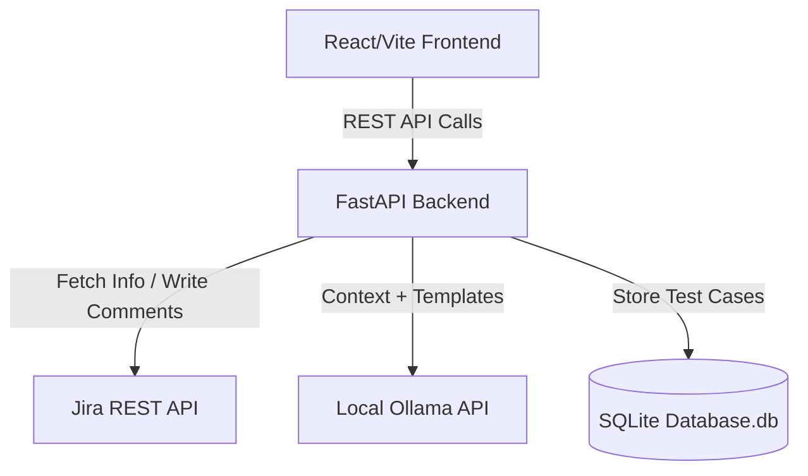

# Jira Test Case Generator

A full-stack web application to auto-generate QA test cases from Jira user stories using a local instance of Ollama (LLM) and saving them into an SQLite database.

## Architecture



## Setup & Run Instructions

### 1. Backend (FastAPI)
1. Navigate into backend folder:
   ```bash
   cd backend
   ```
2. Configure `.env` (Optional defaults are provided):
   ```env
   OLLAMA_BASE_URL=http://localhost:11434
   OLLAMA_MODEL=llama3.1
   ```
3. Install dependencies:
   ```bash
   pip install -r requirements.txt
   ```
4. Start the backend Server:
   ```bash
   uvicorn app.main:app --reload
   ```
   *The API will be available at http://localhost:8000*

### 2. Frontend (React)
1. Navigate into frontend folder:
   ```bash
   cd frontend
   ```
2. Install dependencies:
   ```bash
   npm install
   ```
3. Run dev server:
   ```bash
   npm run dev
   ```
   *The frontend will run at http://localhost:5173*

### 3. Ollama Configuration
Ensure you have Ollama installed locally and the corresponding model pulled before generating tickets:
```bash
ollama run llama3.1
```
